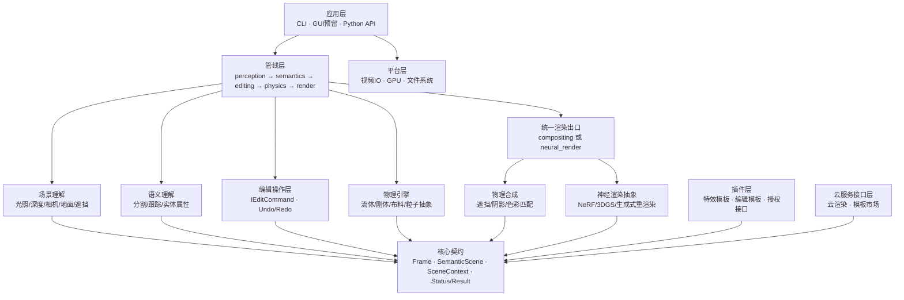
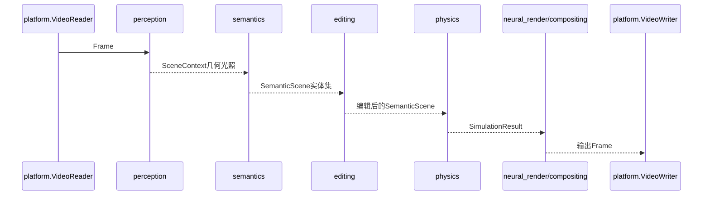

# PhysFX Engine 架构说明

## 产品北极星

PhysFX 从“物理特效合成引擎”升级为“视频世界编辑器”：视频先被理解为可交互的语义场景，再通过命令编辑、物理模拟和双渲染路径输出。能力层与模板层严格分离，复杂能力封装成普通用户可理解的模板。

## 分层与依赖

`perception`、`semantics`、`editing`、`physics`、`compositing` 与 `neural_render` 是同级能力域，只依赖 `core` 契约，不互相包含对方实现头文件。`pipeline` 负责依赖注入和阶段编排；`plugins` 与 `cloud` 不被核心强制调用。

## 数据流

`SceneContext.semanticScene` 使用可选共享指针向后兼容 Phase 1；旧代码不初始化该字段时，物理和合成桩仍保持原有行为。`SimulationResult` 继续由 `core` 定义，避免渲染层反向依赖 physics。

## 阶段与可禁用性

`Config` 中的 `perceptionEnabled`、`semanticsEnabled`、`editingEnabled`、`physicsEnabled`、`renderEnabled` 对应五个阶段。`StageFactory::createPipeline` 装配桩实现，任一阶段可禁用；编辑阶段默认执行 `EmptyCommand`，语义阶段可关闭以复现纯物理管线。

## 商业边界

模板包必须通过 `IEffectPlugin`/`IEditTemplatePlugin`，签名和授权只经过 `ILicenseVerifier`；云渲染和市场只通过 `cloud/` 接口。核心构建产物不包含网络调用、授权强制逻辑或闭源依赖。
